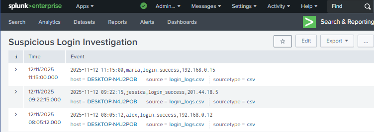
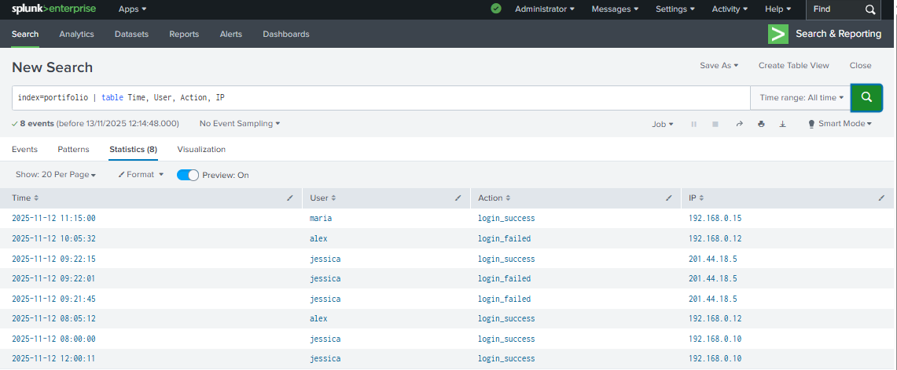

# 🧠 Project 1 — Fake Attack Log Investigation (Splunk)

## 🎯 Objective
Simulate a security investigation using *Splunk Free (Local)* and a custom dataset to detect suspicious login 
activities and uderstand how analysts use SIEM tools to identify potential threats.

---

## 🧩 Dataset
A custom dataset was manually created in a .csv file named login_logs.csv, simulating Windows login events.
Each record includes fields such as timestamp, username, source IP, and login status (success or failed).
This file was indexed in Splunk under the index name portifolio.

---

## ⚙️ Steps Summary
 1. Installed and opened Splunk Free locally on an Ubuntu virtual machine.
 2. Created and indexed the file "login_logs.csv" into Splunk using the index "portifolio".
 3. Used Search & Reporting to run basic queries:

    - Count all events:
       index="portifolio"
      
    - Failed login attempts:
       index="portifolio" status="failed"

    -Successful logins from unusual IPs:
     index="portifolio" status="success" NOT IP="192.168.*"

 4. Created a Dashboard including:
    Failed vs successful logins
    Top source IP addresses
    Timeline of login attempts
    Table view of all login events

---

## 📊 Dashboard Example
  
Example:

Table of events:

---

## 🔍 Results
- Detected multiple failed login attempts from external IPs.  
- Identified a successful login from a new country (possible credential compromise).  
- Visualized attack timeline and login patterns.

---

## 💡 Key Takeaways
- Gained hands-on experience indexing and analyzing CSV log data in Splunk.  
- Learned how to filter, visualize, and interpret login activities.  
- Understood how data can simulate security incidents for learning SIEM operations.  

---

## 🚀 Next Steps
- Ingest Linux and network logs for correlation analysis.  
- Add alerts for unusual login times or IPs.  
- Simulate brute-force or phishing scenarios to expand the lab.

---

## 🧰 Tools Used
- *Splunk Free (Local)*  
- *Custom CSV log dataset* 
- *Markdown for documentation (GitHub)*

---

## 👩‍💻 Author
Jessica Braz — Cybersecurity Student  
Location: Australia  
GitHub: https://github.com/jessicabraz

